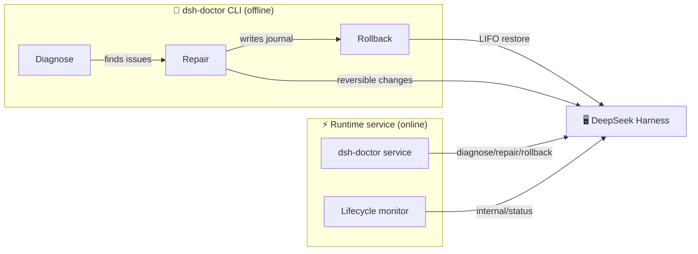

<div align="center">

# 🩺 dsh-doctor

### Your personal doctor for DeepSeek Harness

**Diagnose · Reversible Repair · One-click Rollback · Runtime Self-healing**

[](https://www.npmjs.com/package/@jorinyang/dsh-doctor)
[](https://www.npmjs.com/package/@jorinyang/dsh-doctor)
[](LICENSE)
[](https://github.com/jorinyang/dsh-doctor)

**中文** · [README.md](./README.md)

</div>

---

> **DSH crashed? Can't start?**
>
> Two commands to catch your emotions and fix the root cause.

```bash
# ① Install
dsh plugin --profile web add @jorinyang/dsh-doctor

# ② Fix
dsh-doctor
```

**Built-in CLI, auto-registered to system PATH on install. Repairs are fully reversible — roll back anytime.**

---

## 💡 What it is

DeepSeek Harness ships no built-in `doctor` command. When DSH crashes, fails to start, or a plugin breaks the profile, you're left staring at errors and hoping a restart will help.

**dsh-doctor** is the first all-in-one "diagnose + repair + rollback" tool for DSH, and it's also a **runtime self-healing service**:

| Capability | Form | Description |
|-----------|------|-------------|
| 🔍 **Diagnose** | `dsh_doctor` tool / `dsh-doctor` CLI | Read-only 9-category checks |
| 🔧 **Repair** | `dsh_doctor_fix` tool / `dsh-doctor fix` | Graded repair, every reversible change journaled |
| ↩️ **Rollback** | `dsh_doctor_rollback` tool / `dsh-doctor rollback` | LIFO undo to the pre-repair state |
| ⚡ **Runtime service** | `dsh-doctor` Cordis service | Live diagnose/self-heal/lifecycle monitoring |

---

## ✨ Why dsh-doctor

### 🎯 Two commands to revive a crashed DSH

No need to read error logs or hand-edit configs:

```bash
dsh-doctor          # diagnose first
dsh-doctor fix      # then repair
```

### ↩️ Reversible repairs — safe to fix

Every fix writes a **journal** recording the undo step of each change. Broke something? One command to undo:

```bash
dsh-doctor rollback              # undo the most recent repair
dsh-doctor rollback --list       # list all journals
dsh-doctor rollback --id <id>    # undo a specific journal
```

### ⚡ Runtime self-healing — works while DSH is alive

Not just stop-and-fix. dsh-doctor wires into Cordis's native runtime:

- `ctx.provide('dsh-doctor')` — expose diagnose/repair/rollback to other plugins
- `ctx.on('internal/status')` — reactive plugin-lifecycle monitoring with FAILED alerts
- `ctx.effect()` — reversible effects, no residue on unload

### 🌍 Cross-platform, zero config

Auto-registers to system PATH on install — Windows / macOS / Linux / fish.

---

## 🚀 Quick start

### Option A: DSH plugin (for the agent)

```bash
# install from npm
dsh plugin --profile web add @jorinyang/dsh-doctor

# restart dsh web
dsh web
```

Then ask the agent:

```text
run dsh_doctor                     # diagnose
run dsh_doctor_fix with scope safe # repair
run dsh_doctor_rollback            # rollback if needed
```

### Option B: global CLI

```bash
npm install -g @jorinyang/dsh-doctor
# or
npx @jorinyang/dsh-doctor
```

### Demo

```bash
$ dsh-doctor diagnose --profile web

DSH Diagnostic Report  (profile: web, port: 3080)
DSH home: ~/.dsh

  [OK]   Node.js v24.15.0
  [OK]   pnpm 11.9.0
  [OK]   DSH 0.1.0-rc.6
  [OK]   DSH home exists
  [OK]   profile dir exists: web
  ...
  [XX]   bundle missing: some-broken-plugin
         fix: Run pnpm install in profile dir

  48 pass  0 fail  3 warn
  ✓ No blocking issues found; DSH should start normally.
```

---

## 📖 Command reference

| Command | Description | Alias |
|---------|-------------|-------|
| `dsh-doctor` | Read-only diagnose (default) | `diagnose` / `check` |
| `dsh-doctor fix` | Reversible repair | `repair` |
| `dsh-doctor rollback` | LIFO undo | `undo` |
| `dsh-doctor rollback --list` | List journals | `journals` / `list` |
| `dsh-doctor setup` | Register to PATH | `install` / `register` |

### Options

| Option | Description | Default |
|--------|-------------|---------|
| `--profile <name>` | DSH profile name | `web` |
| `--port <number>` | Web port | `3080` |
| `--scope <level>` | safe / deps / full | `safe` |
| `--id <id>` | Journal id to roll back | most recent |
| `-h, --help` | Help | |
| `-V, --version` | Version | |

### Repair scopes

| Scope | Actions | Risk |
|-------|---------|------|
| `safe` ⭐ | create missing dirs/files; fix allowBuilds | 🟢 Low — files/config |
| `deps` | safe + `pnpm install --fix-lockfile` | 🟡 Medium — network + deps |
| `full` | deps + stop residual processes (skip if healthy) | 🔴 Higher — process kill |

---

## 🏗️ How it works

dsh-doctor aligns with DeepSeek Harness / Cordis's **Spatiotemporal Composability** paradigm:



### Temporal — reversible repairs

Every change records a **reverse undo function**; rollback replays LIFO:

- overwritten file → original saved, restored on rollback
- created file/dir → deleted on rollback (empty dirs only)
- system-boundary ops (pnpm install, killed processes) → flagged manual

### Spatial — runtime self-healing

Wires into Cordis primitives to declare deps and react to changes:

- `ctx.provide` — provide services
- `ctx.on` — reactive listeners
- `ctx.effect` — reversible effects

---

## 🆚 vs. traditional approaches

| | Restart roulette | Hand-edit config | **dsh-doctor** |
|---|---|---|---|
| Diagnose | ❌ guesswork | ⚠️ experience | ✅ 9 automated checks |
| Repair | ❌ kill & retry | ⚠️ error-prone | ✅ graded auto-repair |
| Rollback | ❌ none | ❌ none | ✅ one-click LIFO |
| Runtime adjust | ❌ restart only | ❌ downtime | ✅ Cordis service |
| Cross-platform | — | — | ✅ Win/macOS/Linux/fish |

---

## ❓ FAQ

**Q: DSH is so broken the plugin can't load — still usable?**

Yes. `dsh-doctor` is a self-contained CLI that doesn't depend on DSH running. Just run `dsh-doctor fix`.

**Q: Will repair break my config?**

No. Every reversible change records an undo step first. `dsh-doctor rollback` restores it.

**Q: safe / deps / full — which to pick?**

Start with `safe` (files/config only, zero risk). Escalate to `deps` (reinstall) then `full` (process cleanup) only if needed.

**Q: Does it conflict with built-in DSH commands?**

No. It's an independent plugin + CLI; it doesn't modify DSH core.

---

## 🤝 Contributing

Issues and PRs welcome. For bug reports, please include `dsh-doctor diagnose` output.

## 📄 License

[MIT](LICENSE)

---

<div align="center">

**DeepSeek Harness, painlessly.** 🎉

If it helped you, ⭐ Star this repo!

</div>
