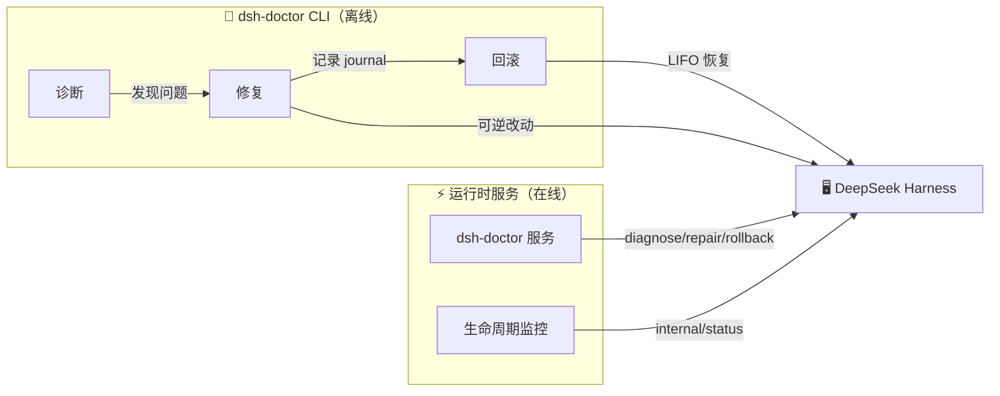

<div align="center">

# 🩺 dsh-doctor

### DeepSeek Harness 的私人医生

**崩溃诊断 · 可逆修复 · 一键回滚 · 运行时自愈**

[](https://www.npmjs.com/package/@jorinyang/dsh-doctor)
[](https://www.npmjs.com/package/@jorinyang/dsh-doctor)
[](LICENSE)
[](https://github.com/jorinyang/dsh-doctor)

**English** · [README.en.md](./README.en.md)

</div>

---

> **崩溃报错，无法启动？**
>
> 两行命令接住你的情绪，解决你崩溃的源头。

```bash
# ① 安装
dsh plugin --profile web add @jorinyang/dsh-doctor

# ② 修复
dsh-doctor
```

**自带 CLI，安装自动注册到系统 PATH，直接执行即可。修复全程可逆，改坏了随时回滚。**

---

## 💡 它是什么

DeepSeek Harness 没有内置 `doctor` 命令。当 DSH 崩溃、启动失败、或某个插件破坏了 profile 时，你只能对着报错干瞪眼，靠重启进程碰运气。

**dsh-doctor** 是 DSH 的第一款「诊断 + 修复 + 回滚」一体化工具，同时也是一个**运行时自愈服务**：

| 能力 | 形态 | 说明 |
|------|------|------|
| 🔍 **诊断** | `dsh_doctor` 工具 / `dsh-doctor` CLI | 只读检查 9 大类，报告哪里坏了、为什么 |
| 🔧 **修复** | `dsh_doctor_fix` 工具 / `dsh-doctor fix` | 分级修复，每个可逆改动都记录 undo 步骤 |
| ↩️ **回滚** | `dsh_doctor_rollback` 工具 / `dsh-doctor rollback` | LIFO 逆序回滚，恢复到修复前 |
| ⚡ **运行时服务** | `dsh-doctor` Cordis 服务 | DSH 存活时动态诊断、自愈、监控生命周期 |

---

## ✨ 为什么选择它

### 🎯 两行命令，救活崩溃的 DSH

不需要读懂报错，不需要手改配置文件：

```bash
dsh-doctor          # 先诊断，看问题出在哪
dsh-doctor fix      # 再修复，自动处理
```

### ↩️ 修复可逆，敢改才敢修

每次修复都会生成一个 **journal**，记录每个改动的 undo 步骤。改坏了？一条命令回到解放前：

```bash
dsh-doctor rollback              # 回滚最近一次修复
dsh-doctor rollback --list       # 列出所有修复日志
dsh-doctor rollback --id <id>    # 回滚指定日志
```

### ⚡ 运行时自愈，DSH 活着也能调

不是只能「停机修复」。dsh-doctor 通过 Cordis 原生能力接入运行时：

- `ctx.provide('dsh-doctor')` — 暴露诊断/修复/回滚 API 给其他插件
- `ctx.on('internal/status')` — 响应式监控插件生命周期，检测 FAILED 自动告警
- `ctx.effect()` — 可逆效应，卸载无残留

### 🌍 跨平台，开箱即用

安装后自动注册到系统 PATH，Windows / macOS / Linux / fish 全覆盖，无需手动配置。

---

## 🚀 快速开始

### 方式一：DSH 插件（Agent 内使用）

```bash
# 从 npm 安装
dsh plugin --profile web add @jorinyang/dsh-doctor

# 重启 dsh web
dsh web
```

安装后，在对话中告诉 agent：

```text
运行 dsh_doctor          # 诊断
用 safe 范围运行 dsh_doctor_fix   # 修复
运行 dsh_doctor_rollback           # 需要时回滚
```

### 方式二：全局 CLI（命令行直接使用）

```bash
npm install -g @jorinyang/dsh-doctor
# 或
npx @jorinyang/dsh-doctor
```

### 演示

```bash
$ dsh-doctor diagnose --profile web

DSH Diagnostic Report  (profile: web, port: 3080)
DSH home: ~/.dsh

  [OK]   Node.js v24.15.0
  [OK]   pnpm 11.9.0
  [OK]   DSH 0.1.0-rc.6
  [OK]   DSH home exists
  [OK]   profile dir exists: web
  ...
  [XX]   bundle missing: some-broken-plugin
         fix: Run pnpm install in profile dir

  48 pass  0 fail  3 warn
  ✓ No blocking issues found; DSH should start normally.
```

---

## 📖 命令速查表

| 命令 | 说明 | 别名 |
|------|------|------|
| `dsh-doctor` | 只读诊断（默认） | `diagnose` / `check` |
| `dsh-doctor fix` | 修复（可回滚） | `repair` |
| `dsh-doctor rollback` | 回滚（LIFO） | `undo` |
| `dsh-doctor rollback --list` | 列出修复日志 | `journals` / `list` |
| `dsh-doctor setup` | 注册到系统 PATH | `install` / `register` |

### 通用选项

| 选项 | 说明 | 默认 |
|------|------|------|
| `--profile <name>` | DSH profile 名称 | `web` |
| `--port <number>` | Web 端口 | `3080` |
| `--scope <level>` | safe / deps / full | `safe` |
| `--id <id>` | 回滚目标 journal id | 最近一次 |
| `-h, --help` | 帮助 | |
| `-V, --version` | 版本 | |

### 修复范围（scope）

| 范围 | 动作 | 风险 |
|------|------|------|
| `safe` ⭐ | 创建缺失目录/文件；修复 allowBuilds 占位符 | 🟢 低 — 仅文件/配置 |
| `deps` | safe 全部 + `pnpm install --fix-lockfile` | 🟡 中 — 网络 + 依赖 |
| `full` | deps 全部 + 停止残留进程（健康时跳过） | 🔴 较高 — 进程终止 |

---

## 🏗️ 工作原理

dsh-doctor 对齐 DeepSeek Harness / Cordis 的「**时空可组合（Spatiotemporal Composability）**」范式：



### 时间可组合（Temporal）— 修复可逆

每个改动都记录**反向撤销函数**，回滚按 LIFO 逆序执行：

- 覆盖文件 → 保存原始内容，回滚时恢复
- 新建文件/目录 → 回滚时删除（仅空目录）
- 系统边界操作（pnpm install、杀进程）→ 标记「需手动补偿」

### 空间可组合（Spatial）— 运行时自愈

通过 Cordis 原生能力声明依赖、响应变化：

- `ctx.provide` — 提供服务
- `ctx.on` — 响应式监听
- `ctx.effect` — 可逆效应

---

## 🆚 为什么不用传统方案

| | 传统「重启大法」 | 手动改配置 | **dsh-doctor** |
|---|---|---|---|
| 诊断 | ❌ 靠猜 | ⚠️ 靠经验 | ✅ 9 大类自动检查 |
| 修复 | ❌ 杀进程重来 | ⚠️ 手改易错 | ✅ 分级自动修复 |
| 回滚 | ❌ 无 | ❌ 无 | ✅ 一键 LIFO 回滚 |
| 运行时调整 | ❌ 只能重启 | ❌ 停机 | ✅ Cordis 动态服务 |
| 跨平台 | — | — | ✅ Win/macOS/Linux/fish |

---

## ❓ FAQ

**Q：DSH 崩溃到连插件都加载不了，还能用吗？**

能。`dsh-doctor` 是自包含 CLI，不依赖 DSH 运行。DSH 崩了也能直接 `dsh-doctor fix`。

**Q：修复会破坏我的配置吗？**

不会。每个可逆改动都先记录 undo 步骤，改坏了 `dsh-doctor rollback` 一键恢复。

**Q：`safe` / `deps` / `full` 怎么选？**

先用 `safe`（仅文件/配置，零风险）。没解决再升级 `deps`（重装依赖），最后 `full`（清理进程）。

**Q：它和 DSH 自带的命令冲突吗？**

不冲突。dsh-doctor 是独立插件 + 独立 CLI，不修改 DSH 核心。

---

## 🤝 贡献

欢迎提 Issue、PR。Bug 报告请附带 `dsh-doctor diagnose` 的输出。

## 📄 许可证

[MIT](LICENSE)

---

<div align="center">

**无痛折腾 DeepSeek Harness** 🎉

如果你觉得有用，点个 ⭐ Star 支持一下吧！

</div>
